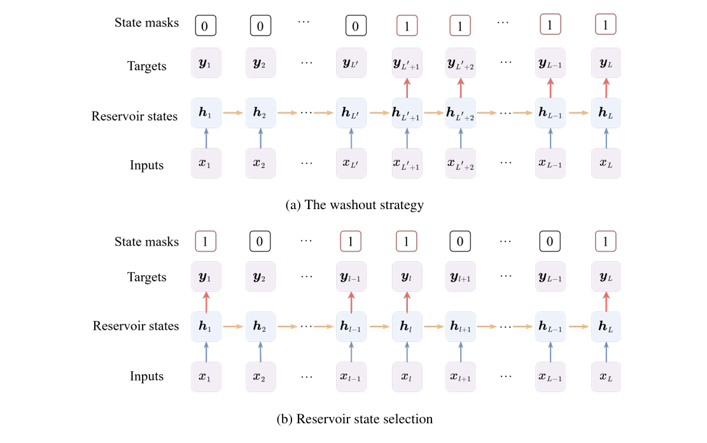

# Enhancing Echo State Network with Reservoir State Selection for Time Series Forecasting
This is the PyTorch implementation of the original paper, 'Enhancing Echo State Networks with Reservoir State Selection for Time Series Forecasting'. Here, a novel particle swarm Bayesian optimisation (PSBO) approach is proposed to adaptively select the most informative reservoir states within an echo state network (ESN) to enhance the performance of the ESN model in time series forecasting.
<p align="center">
    
</p>

# Getting Started
To get started, ensure you have Conda installed on your system and follow these steps to set up the environment:
* python == 3.8.10
* numpy == 1.20.2
* pandas == 1.3.5
* scikit_learn == 0.24.2
* torch == 1.9.0
* ray == 2.5.0
* optuna == 2.8.0

### Dataset
All the datasets can be found in ```./data/```, which are obtained from the following public links and cover different climate types.
* Lorenz : https://github.com/wang3597/TESN/blob/main/TESN/datasets/Lorenz.txt
* Sunspot : https://github.com/wang3597/TESN/blob/main/TESN/datasets/Sunspots.txt
* GEFCom2017 : https://github.com/camroach87/gefcom2017data

### Examples
The experiment settings for all datasets are provided under the folder ```./exp/```. For your convenience, the execution checkpoints and results are also provided in the folder ```./test/```. You can easily reproduce the results of the *PSBO-ESN* using the following Python command:

```
python run.py
```

# Acknowledgement
This work was supported by the Postdoctoral Science Foundation (2024M761027), the National Natural Science Foundation of China (72242104), and the Interdisciplinary Research Program of Hust (2024JCYJ020).

This library is constructed based on the following repos:
* https://github.com/Analytics-for-Forecasting/OpenForecasting

# Contact
For any questions, you are welcome to contact us via xinze@hust.edu.cn.

# Citation
```
```
